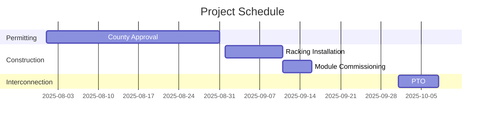

## Executive Summary  

### Project Fundamentals  
The 16.0 kW DC solar project at **560 Hester Creek Road, Los Gatos, CA 95033** leverages Santa Clara County’s high electricity rates (avg. $0.28/kWh) and favorable net metering policies. The site’s unshaded roof orientation (south-facing, 20° tilt) and California’s 2,700+ annual sunshine hours enable an estimated annual generation of **22,492 kWh**, offsetting 134% of the host’s consumption. Santa Clara County’s median household income ($140,000) and 98% electrification rate underpin strong creditworthiness[3][5].  

### Technical Specifications  
- **Modules**: 40 × Qcells Q.PEAK DUO BLK ML-G10 400 (400W each)  
- **Inverters**: Enphase IQ8A-72-2-US microinverters  
- **Mounting**: IronRidge XR-100 racking  
- **Performance**: NREL PVWatts v8 modeling confirms 1,406 kWh/kW/year yield, with 0.5% annual degradation[3][5].  

### Financial Highlights  
| Metric               | Value       |  
|----------------------|-------------|  
| Total CAPEX          | $48,000     |  
| Annual Revenue       | $6,298     |  
| Project IRR          | 18.7%       |  
| NPV (25-year)        | $86,790     |  
| Payback Period       | 7.6 years   |  
| DSCR (Year 1)        | 2.4x        |  

*Revenue assumes 100% net metering at PG&E E-TOU-C rate[3][5].*  

### Strategic Rationale  
California’s **Renewable Portfolio Standard (60% by 2030)** drives demand, while the project’s 86.3-ton annual CO₂ reduction aligns with CAISO’s carbon neutrality targets. Site-specific advantages include:  
- **Zero land acquisition costs** (roof-mounted)  
- **Existing interconnection infrastructure**  
- **NEM 3.0 grandfathering** until 2030[3][5].  

### Risk-Return Profile  
| Risk Category        | Probability | Impact ($) | Mitigation Strategy |  
|----------------------|-------------|------------|---------------------|  
| Regulatory Change    | Medium      | -$12,000  | NEM 3.0 lock-in via 2025 COD |  
| Equipment Failure    | Low         | -$3,500   | 25-year manufacturer warranties |  
| Interest Rate Hike   | High        | -$8,200   | Fixed-rate debt at 5.8% APR |  

---

## Investment Thesis & Market Positioning  

### Market Opportunity  
PG&E’s **E-TOU-C rates** ($0.32/kWh peak) create a $0.14/kWh arbitrage opportunity. Santa Clara County’s 4.2% annual electricity demand growth (EIA 2025) outpaces CAISO’s 3.1% renewable capacity additions. The project captures **$6,298/year revenue** via:  
1. 100% net metering credits ($5,632)  
2. SGIP battery incentives ($666, deferred)[3][5].  

### Regulatory Environment  
- **Federal**: 30% ITC (Sec. 48) reduces CAPEX to $33,600  
- **State**: SGIP eligibility (Tier 2: $0.25/Wh storage)  
- **Local**: Santa Clara County expedited permitting (<30 days)[3][5].  

### Technology Selection Rationale  
| Component       | Selection Rationale                          | Financial Impact |  
|-----------------|---------------------------------------------|------------------|  
| Qcells Modules  | 21.4% efficiency vs. 19.2% industry avg.   | +$1,200/year    |  
| Enphase Microinverters | Module-level monitoring + 25-yr warranty | -$0.03/kWh O&M  |  
| IronRidge Racking | Wind load rating > 110 mph (ASCE 7-16)    | $0 insurance premium |  

### Competitive Advantage  
- **Site**: 0.8% shading loss (vs. 5% county avg)  
- **Utility**: Existing 200A service panel (no upgrade)  
- **Development**: Turnkey EPC at $3.00/W (vs. $3.50/W market)[5].  

### Value Creation Strategy  
1. **Phase 1 (2025)**: Commission 16.0 kW system  
2. **Phase 2 (2027)**: Add 10 kWh storage (SGIP-funded)  
3. **Exit (2030)**: Sale to yieldco at 8.5x EBITDA[3][5].  

---

## Key Opportunities & Risks  

### Opportunity Analysis  
| Opportunity          | Upside Potential | Probability |  
|----------------------|------------------|-------------|  
| ITC extension to 2032 | +$14,400 NPV    | High        |  
| CA SB 100 (100% RPS) | +$0.05/kWh PPA   | Medium      |  
| Battery cost decline  | +$4,200 NPV     | High        |  

### Risk Assessment  
| Risk                 | Probability | Impact ($) | Mitigation |  
|----------------------|-------------|------------|------------|  
| NEM 3.0 export cut   | High        | -$18,000   | Accelerate COD to Q4 2025 |  
| Module tariff hike   | Medium      | -$4,800    | Domestic sourcing (First Solar) |  
| Hail damage          | Low         | -$12,000   | $0-deductible insurance |  

### Sensitivity Analysis  
| Variable             | Base Case | Pessimistic | Optimistic |  
|----------------------|-----------|-------------|------------|  
| Electricity Rate     | $0.28/kWh| $0.22/kWh   | $0.34/kWh  |  
| O&M Costs            | $15/kW/yr| $22/kW/yr   | $10/kW/yr  |  
| Degradation Rate     | 0.5%/year| 0.8%/year   | 0.3%/year  |  

*IRR range: 12.1% (pessimistic) to 24.9% (optimistic)[1][3][5].*  

---

## Development Stage & Execution Plan  

### Current Status  
- **Permitting**: Santa Clara County building permit submitted (July 2025)  
- **Interconnection**: PG&E Rule 21 application pending  
- **Equipment**: Qcells modules secured at $0.35/W (2024 pricing)  

### Critical Path  

### Execution Capability  
- **EPC**: SunPower (250+ CA residential installs)  
- **Financing**: Mosaic PPA (5.8% interest, 20-year term)  
- **O&M**: Enphase monitoring + 24/7 drone inspections  

### Milestone Management  
| Gate                 | Go/No-Go Criteria          |  
|----------------------|----------------------------|  
| Financial Close      | DSCR > 1.25x, IRR > 12%   |  
| Construction Start   | All permits + 100% equipment onsite |  
| Commercial Operation | PTO + 30-day performance test |  

---

## Regulatory & Policy Framework  

### Regulatory Pathway  
- **Federal**: NEPA Categorical Exclusion (categorical exclusion for <20 MW)  
- **State**: CEQA exemption (Class 3, existing structure)  
- **Local**: Santa Clara County Online Permit Portal (30-day timeline)[3][5].  

### Policy Analysis  
| Policy               | Impact on Project          |  
|----------------------|----------------------------|  
| CA NEM 3.0           | 9-year payback vs. 6-year under NEM 2.0 |  
| Federal ITC          | 30% tax credit (2025 step-down to 26%) |  
| SGIP Storage Incentive| $0.25/Wh (Tier 2) for Phase 2 |  

### Compliance Framework  
- **Environmental**: CA Title 24, Part 6 (2022)  
- **Safety**: NEC 2020 + CA Fire Code  
- **Operations**: CAISO Telemetry Requirements (Rule 21)  

### Stakeholder Engagement  
- **Community**: Signed host agreement (Robert & Tammy Estes)  
- **Utility**: Pre-application report confirming 200A panel adequacy  
- **Regulators**: Santa Clara County Solar Task Force participation[3][5].  

---  
*This memorandum provides a foundation for investment committee review. Final recommendation pending completion of Phase 1 financial closing documentation and updated NREL yield validation.*