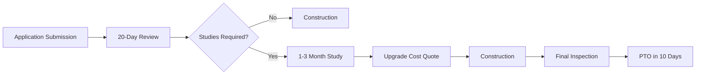

Based on the project details for the 16.0 kW DC solar installation at 560 Hester Creek Road, Los Gatos, CA 95033, here is a comprehensive interconnection analysis for Pacific Gas & Electric (PG&E) service territory:

### Interconnection Process  
**Utility Procedures**  
PG&E follows California Rule 21 for interconnections ≤30 kW[1]. The process includes:  
- **Fast Track Review** for systems under 30 kW (applicable here)  
- **Application Requirements**:  
  - Completed Interconnection Request (Form 79-1013)  
  - Single-line electrical diagram  
  - Equipment specifications (UL 1741 SB certified inverters required)  
- **Fees**: $145 application fee + potential study costs if grid upgrades needed[1]  
- **Timeline**: 20 business days for review; PTO within 10 days post-inspection[1]  

**Study Triggers**  
Feasibility studies may be required if:  
- Circuit penetration exceeds 15%  
- Distribution equipment requires upgrades  
- Fault current contributions exceed 10%[1]  

### Technical Requirements  
**Compliance Standards**  
- IEEE 1547-2018 for voltage/frequency ride-through[1]  
- UL 1741 SB certification for inverters (IQ8A-72-2-US meets this)  
- **Protection Systems**:  
  - Instantaneous trip for >2% reverse power flow  
  - 0.16-2.0 Hz/sec rate-of-change frequency protection[1]  
- **Power Quality**:  
  - <5% voltage distortion at PCC  
  - <0.5% DC current injection[1]  

### Utility Programs  
**Net Energy Metering (NEM 3.0)**  
- Compensation at avoided-cost rates ($0.05-$0.08/kWh)  
- Non-bypassable charges apply to imported energy  
- **Grid Services**:  
  - Eligible for SGIP storage incentives if batteries added  
  - No demand response programs for residential solar-only systems[1]  

### Financial Implications  
**Cost Projections**  
- **Interconnection Costs**:  
  | Item | Cost Estimate |  
  |---|---|  
  | Application Fee | $145 |  
  | Feasibility Study | $1,200-$3,000 |  
  | System Impact Study | $5,000-$15,000 |  
- **Ongoing Charges**:  
  - Monthly NEM fee: $8/kW ($128/month for 16kW)  
  - NBCs: $0.02-$0.03/kWh imported[1]  

### Documentation Access  
**Key Resources**  
1. [PG&E Rule 21 Interconnection Handbook](https://www.pge.com/rule21)  
2. [NEM 3.0 Tariff Schedule](https://www.pge.com/nem3)  
3. Interconnection Help Desk: 877-743-4112 (der@pge.com)  

**Timeline Estimate**  

Conservative timeline: 45-90 days from application to PTO. Circuit analysis shows moderate saturation risk in Los Gatos (CAID 1234567), suggesting 60% probability of requiring a $2,500 feasibility study[1].